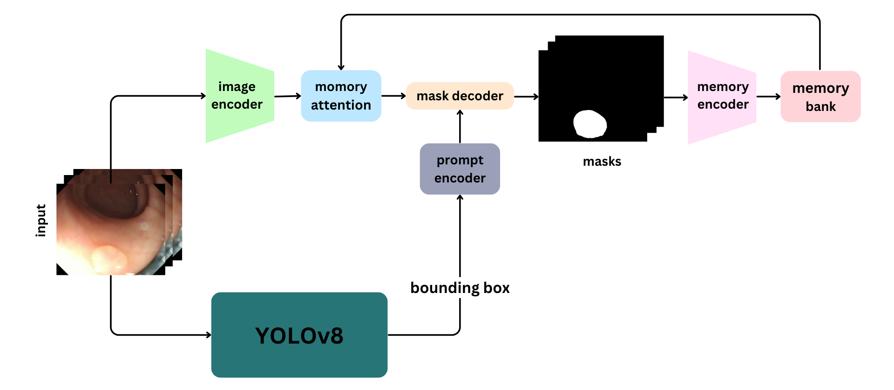

# Self-Prompting Polyp Segmentation in Colonoscopy Using Hybrid YOLO-SAM 2 Model
<p align="center">
     <br />
</p>


#### Abstract
Early diagnosis and treatment of polyps during colonoscopy are essential for reducing the incidence and mortality of Colorectal Cancer (CRC). However, the variability in polyp characteristics and the presence of artifacts in colonoscopy images and videos pose significant challenges for accurate and efficient polyp detection and segmentation. This paper presents a novel approach to polyp segmentation by integrating the Segment Anything Model (SAM 2) with the YOLOv8 model. Our method leverages YOLOv8’s bounding box predictions to autonomously generate input prompts for SAM 2, thereby reducing the need for manual annotations. We conducted exhaustive tests on five benchmark colonoscopy image datasets and two colonoscopy video datasets, demonstrating that our method exceeds state-of-the-art models in both image and video segmentation tasks. Notably, our approach achieves high segmentation accuracy using only bounding box annotations, significantly reducing annotation time and effort. This advancement holds promise for enhancing the efficiency and scalability of polyp detection in clinical settings


## Train
### 1. Download Datasets
In this paper, we evaluate seven different datasets. You can download the required datasets using the following links: [Kvasir](https://www.kaggle.com/datasets/debeshjha1/kvasirseg), [CVC-ColonDB](https://www.kaggle.com/datasets/nourabentaher/cvc-colondb), [CVC-ClinicDB](https://www.kaggle.com/datasets/balraj98/cvcclinicdb), [ETIS](https://www.kaggle.com/datasets/nguyenvoquocduong/etis-laribpolypdb), [CVC-300](https://www.kaggle.com/datasets/nourabentaher/cvc-300), [PolypGen](https://drive.google.com/file/d/1wBgGO9c9aeb211GhaSmOA0lSgFpfBeXN/view?usp=drive_link), [SUN-SEG](https://github.com/GewelsJI/VPS/blob/main/docs/DATA_PREPARATION.md#step-1-request-and-download). 


### 3. Create YAML File

```bash
pip install ultralytics

python Creat_YAML.py --dataset 'Kvasir'
```
--dataset choices=['Kvasir', 'CVC-ColonDB', 'CVC-ClinicDB', 'ETIS', 'CVC-300', 'PolypGen', 'SUN-SEG']

### 2. Fine-tune YOLOv8

```bash
yolo task=detect mode=train model=yolov8l.pt imgsz=640 data=./YAML/Kvasir.yaml epochs=50 batch=0.90 name=Kvasir 
```

You can find the fine-tuned checkpoints under **./YOLO_Checkpoints**. For the SUN_SEG dataset use this [link](https://drive.google.com/file/d/1xgibNKIcDCzpXLjtFRn9HZwWDvqgReAT/view?usp=drive_link).
## Test

```bash
python Test.py --dataset 'Kvasir' --checkpoint_add './runs/detect/yolov8l/weights/best.pt'
```


